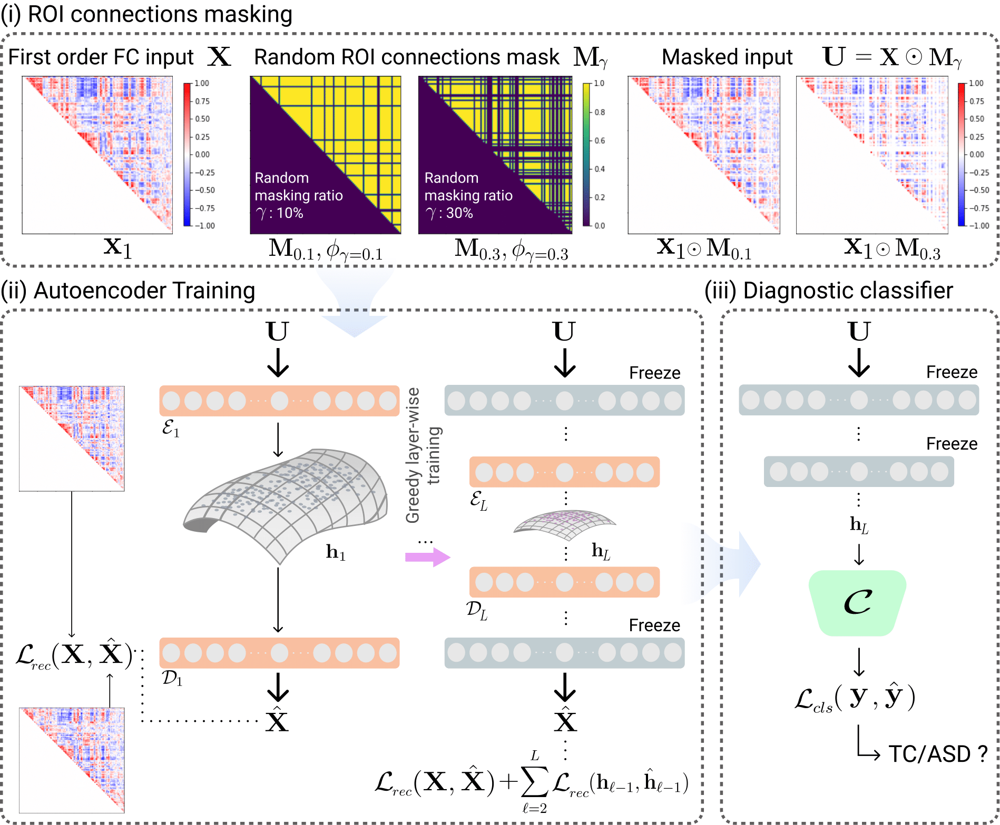

## Inter-Regional High-level Relation Learning from Functional Connectivity via Self-Supervision
<p align="center"></p>

This repository provides the official PyTorch implementation of the following paper:
> **Inter-Regional High-level Relation Learning from Functional Connectivity via Self-Supervision**<br>
> [Wonsik Jung](https://github.com/ssikjeong1/)<sup>1</sup>, [Da-Woon Heo]()<sup>1</sup>, [Eunjin Jeon]()<sup>1</sup>, [Jaein Lee]()<sup>1</sup>, [Heung-Il Suk](https://scholar.google.co.kr/citations?user=dl_oZLwAAAAJ&hl=ko)<sup>1</sup> 
> (<sup>1</sup>Korea University) <br/>
> [[Official version]]() <br>
> Accepted to MICCAI 2021
> 
> **Abstract:** *In recent studies, we have witnessed the applicability of deep learning methods on resting-state functional magnetic resonance image (rs-fMRI) analysis and its use for brain disease diagnosis, e.g., autism spectrum disorder (ASD). However, it still remains challenging to learn discriminative representations from raw BOLD signals or functional connectivity (FC) with a limited number of samples. In this paper, we propose a simple but efficient representation learning method for FC in a self-supervised learning manner. Specifically, we devise a proxy task of estimating the randomly masked seed-based functional networks from the remaining ones in FC, to discover the complex high-level relations among brain regions, which are not directly observable from an input FC. Thanks to the random masking strategy in our proxy task, it also has the effect of augmenting training samples, thus allowing for robust training. With the pretrained feature representation network in a self-supervised manner, we then construct a decision network for the downstream task of ASD diagnosis. In order to validate the effectiveness of our proposed method, we used the ABIDE dataset that collected subjects from multiple sites and our proposed method showed superiority to the comparative methods in various metrics.*

## Dependencies
* [Python 3.6+](https://www.continuum.io/downloads)
* [PyTorch 0.4.0+](http://pytorch.org/)
* [TensorFlow 1.3+](https://www.tensorflow.org/) (optional for tensorboard)

## Downloading datasets
To download the ABIDE dataset
* http://fcon_1000.projects.nitrc.org/indi/abide/
* http://preprocessed-connectomes-project.org/abide/Pipelines.html

## Usage
For training:

``

## Citation
If you find this work useful for your research, please cite our [paper]():
```
```

## Acknowledgements
This work was supported by National Research Foundation of Korea (NRF) grant funded by the Korea government (MSIT) (No. 2019R1A2C1006543) and by Institute of Information & communications Technology Planning & Evaluation (IITP) grant funded by the Korea government(MSIT) (No. 2019-0-00079 ,  Artificial Intelligence Graduate School Program(Korea University)).
